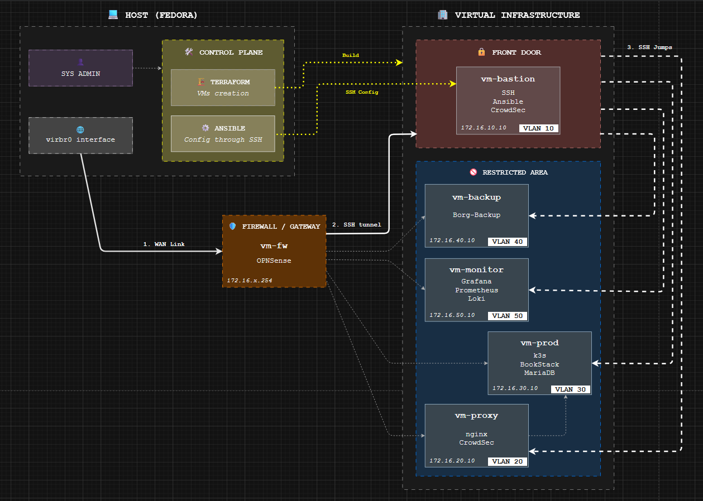

# KVM IaC Lab

[](#)
[](#)
[](#)
[](#)
[](#)
[](#)
[](#)
[](#)
[](#)
[](#)

<br>

## 📖 About The Project

This project provides a **fully automated, secure-by-design infrastructure stack** meant for local development, security simulation, and self-hosting. It leverages **Infrastructure as Code (IaC)** principles to deploy a segmented network behind an enterprise-grade firewall on a Linux KVM hypervisor.

Unlike simple Docker-compose setups, this project simulates a **Real-World Architecture** using nested virtualization (The "Russian Doll" approach):
1.  **Hardware Level:** Your Host Machine (Linux Based).
2.  **Infrastructure Level:** KVM VMs managed by Terraform.
3.  **Application Level:** Docker Containers & Kubernetes Pods managed by Ansible.

It is designed to be **environment-agnostic**: network plans (CIDR), resources (RAM/CPU), and domain names are fully customizable via variables, making it compatible with any homelab setup.

> 🇫🇷 **Français :** La documentation technique détaillée, l'IPAM et la Matrice de Flux sont disponibles en français dans le dossier [docs/fr/](./docs/fr/).

<br>

## 🏗️ Architecture



> Check the [IP Address Management](./docs/ipam.md) for further information.

The stack is strictly segmented into VLANs to enforce a **Zero-Trust** security model:

| Zone | VLAN | Role | Services |
| :--- | :---: | :--- | :--- |
| **WAN** | - | Untrusted | Internet Simulation / NAT |
| **MGMT** | 10 | Restricted | Bastion SSH, Ansible Controller |
| **DMZ** | 20 | Front-End | Nginx Reverse Proxy, CrowdSec Agent |
| **PROD** | 30 | Backend | **K3s Cluster** (BookStack, MariaDB) |
| **BACKUP**| 40 | Isolated | BorgBackup Repository |
| **MONIT** | 50 | Observability | **PLG Stack** (Prometheus, Loki, Grafana) |

> Check the [Firewall Policy](./docs/firewall_policy.md) for further information.
<br>

## 🚀 Getting Started

### Prerequisites

* Linux Host (Debian/Fedora/Ubuntu) with virtualization support (VT-x/AMD-v).
* `libvirt` (KVM) installed and running.
* `terraform` and `ansible` installed.

### 1. Installation
Clone the repository:
```bash
git clone https://github.com/RikoRiken/kvm-iac-lab.git
cd kvm-iac-lab
```

<br>

### 2. Configuration


*incoming...*

<br>

### 3. Deploy

Launch the bootstrap script to build the infrastructure and configure services.

```bash
./scripts/deploy.sh
```
*Note: The deployment takes approximately **5-8 minutes** depending on your internet connection (Cloud Images download).*

<br>

## 🛡️ Security Strategy

- OPNsense Firewall: Acts as the central gateway. All Inter-VLAN traffic is inspected.

- Deny All by Default: No traffic is allowed unless explicitly whitelisted.

- Bastion Host: No direct SSH access to internal VMs. All administration traffic must pass through the Bastion (VLAN 10).

- CrowdSec IPS: Collaborative security agents deployed on the Bastion (SSH protection) and Proxy (HTTP protection).

- Network Isolation: The DMZ cannot access the Backup or Management networks.

<br>

## 🛠️ Built With

- [Terraform](https://www.terraform.io/) - Infrastructure Provisioning (Libvirt Provider).

- [Ansible](https://www.ansible.com/) - Configuration Management & App Deployment.

- [Docker](https://www.docker.com/) - Container Runtime for Monitoring & Proxy.

- [K3s](https://k3s.io/) - Lightweight Kubernetes distribution for Production apps.

- [OPNsense](https://opnsense.org/) - Open Source Firewall & Routing Platform.

<br>

## 📝 License

Distributed under the MIT License. See `LICENSE` for more information.

