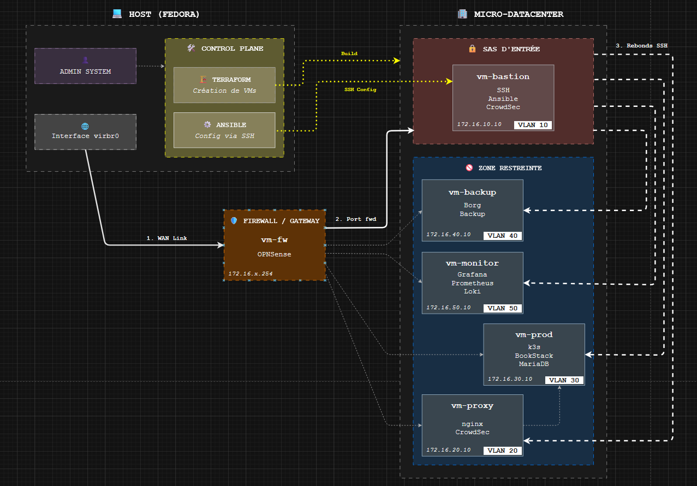

# 🌍 Politique d'Adressage et de Nommage (IPAM)

## 1. Standards & Conventions

### 1.1 Identité Réseau
* **Plage Réseau Privée :** `172.16.0.0/16` (RFC1918)
* **Technologie :** Réseaux virtuels isolés (KVM/Libvirt) routés par OPNsense.

### 1.2 Convention de Nommage
Format : `vm-<rôle>`
* **Exemples :** `vm-bastion`, `vm-prod`, `vm-backup`.

### 1.3 Convention d'Allocation IP
Pour chaque sous-réseau (Subnet `/24`), la répartition est standardisée :

| Plage | Usage | Commentaire |
| :--- | :--- | :--- |
| `.1` - `.9` | **Infrastructure** | Réservé Switchs virtuels & Équipements réseau |
| `.10` - `.99` | **Serveurs (IP Fixe)** | VMs Infrastructure et Applications |
| `.100` - `.199` | **DHCP Pool** | Clients temporaires (si applicable) |
| `.254` | **Gateway** | Interface du Pare-Feu (OPNsense) |

---

## 2. Segmentation & Zones de Sécurité

L'architecture repose sur une segmentation stricte par VLANs (Switchs Virtuels).

| Zone | VLAN ID | CIDR | Niveau de Confiance | Description |
| :--- | :---: | :--- | :---: | :--- |
| **WAN** | - | `192.168.122.0/24` | 🔴 Untrusted | Réseau de transport (NAT Libvirt). Simule Internet. |
| **DMZ** | **20** | `172.16.20.0/24` | 🟠 Semi-Trusted | Zone exposée (Frontal Web). Isolée du LAN. |
| **PROD** | **30** | `172.16.30.0/24` | 🟢 Trusted | Zone applicative critique (App + Data). |
| **MGMT** | **10** | `172.16.10.0/24` | 🔒 Restricted | "Sas d'entrée". Seule zone autorisée à initier du SSH. |
| **BACKUP**| **40** | `172.16.40.0/24` | 🛡️ Sanctuarisé | Zone isolée. Flux entrants limités au strict nécessaire. |
| **MONIT** | **50** | `172.16.50.0/24` | 🔵 Read-Only | Zone d'observation. Collecte les métriques et logs. |

---

## 3. Inventaire Détaillé des Ressources

### 3.1 Cœur de Réseau (Gateway)

| Hostname | IP (Internes) | OS | Rôle |
| :--- | :--- | :--- | :--- |
| **vm-fw** | `172.16.10.254` `172.16.20.254` `172.16.30.254` `172.16.40.254` `172.16.50.254` | **OPNsense** | Pare-feu, Routage Inter-VLAN, DHCP, DNS Resolver. |

### 3.2 Zone MANAGEMENT (VLAN 10)

| Hostname | IP | OS | Services & Sécurité |
| :--- | :--- | :--- | :--- |
| **vm-bastion** | `172.16.10.10` | Debian 12 | **SSH Gateway**, Ansible Controller. 🛡️ *Sécurité :* **CrowdSec Agent** (Protection SSH). |

### 3.3 Zone DMZ (VLAN 20)

| Hostname | IP | OS | Services & Sécurité |
| :--- | :--- | :--- | :--- |
| **vm-proxy** | `172.16.20.10` | Debian 12 | **Nginx** (Reverse Proxy). 🛡️ *Sécurité :* **CrowdSec Agent** (Protection HTTP/L7). |

### 3.4 Zone PRODUCTION (VLAN 30)

| Hostname | IP | OS | Services & Sécurité |
| :--- | :--- | :--- | :--- |
| **vm-prod** | `172.16.30.10` | Debian 12 | **K3s Cluster** (Single Node). 📦 *Apps :* BookStack, MariaDB. |

### 3.5 Zone BACKUP (VLAN 40)

| Hostname | IP | OS | Services & Sécurité |
| :--- | :--- | :--- | :--- |
| **vm-backup** | `172.16.40.10` | Debian 12 | **BorgBackup Repository**. Stockage chiffré et dédupliqué. |

### 3.6 Zone MONITORING (VLAN 50)

| Hostname | IP | OS | Services & Sécurité |
| :--- | :--- | :--- | :--- |
| **vm-monitor** | `172.16.50.10` | Debian 12 | **PLG Stack** : - Prometheus (Métriques) - Loki (Logs) - Grafana (Dashboards) |

---

## 4. Matrice de Flux & Architecture

### 4.1 Schéma d'Architecture
*(Voir le schéma détaillé fourni en annexe du dossier d'architecture)*

### 4.2 Flux d'Administration (Secure Path)
L'accès aux serveurs internes est interdit depuis le LAN utilisateur ou Internet, sauf via le processus suivant :
1.  **Admin** (Poste Fedora) -> SSH -> **Firewall** (Port Forwarding).
2.  **Firewall** -> **vm-bastion** (Vérification Clé SSH + CrowdSec).
3.  **vm-bastion** -> Rebond SSH -> **Cible** (Prod, Backup, etc.).

### 4.3 Flux Applicatif Public
1.  **Internet** -> HTTPS (443) -> **Firewall**.
2.  **Firewall** -> **vm-proxy** (Terminaison SSL).

3.  **vm-proxy** -> HTTP (80) -> **vm-prod** (Service K3s NodePort).
